# Documento Técnico — AnunciosFácil

**Asignatura:** Seguridad de Aplicaciones (SEA)  
**Semestre:** 5 — 2026  
**Tecnologías:** PHP 8.2 · MySQL 8.0 · Apache · Materialize CSS · Docker

---

## 1. Descripción del Proyecto

**AnunciosFácil** es una aplicación web de publicación de anuncios gratuitos que aplica los principios de programación segura del curso SEA. Permite a los usuarios registrarse, publicar anuncios con imagen, y explorar el listado por categoría.

El usuario decide durante el registro si su correo electrónico será visible en sus anuncios (para que los interesados lo contacten directamente).

---

## 2. Arquitectura General

La aplicación sigue el patrón **MVC simplificado** con PHP procedimental, organizado en cuatro capas:

```
┌─────────────────────────────────────────────────────┐
│              Navegador  (HTML5 + Materialize)        │
└────────────────────┬────────────────────────────────┘
                     │ HTTP
┌────────────────────▼────────────────────────────────┐
│         Páginas PHP  (Controladores)                 │
│  index · register · login · logout · create-ad · ad │
├─────────────────────────────────────────────────────┤
│         Core PHP  (Módulos de infraestructura)       │
│         Config · Database (PDO) · Functions          │
├─────────────────────────────────────────────────────┤
│         MySQL 8.0  (Entidades de datos)              │
│         users · categories · ads                     │
└─────────────────────────────────────────────────────┘
```

---

## 3. Diagrama de Clases (PlantUML)

> El archivo fuente se encuentra en `docs/diagrama-clases.puml`.  
> Se puede renderizar con: [PlantUML Online](https://www.plantuml.com/plantuml/uml/), plugin de VS Code, o IntelliJ IDEA.

```plantuml
@startuml AnunciosFacil_DiagramaClases

skinparam linetype ortho
skinparam classAttributeIconSize 0
skinparam classFontSize 12
skinparam classFontStyle Bold
skinparam packageFontSize 13
skinparam packageFontStyle Bold
skinparam defaultFontName Arial
skinparam backgroundColor #FFFFFF
skinparam ArrowColor #455A64
skinparam ArrowThickness 1.5

skinparam class {
    BackgroundColor        #ECEFF1
    BorderColor            #455A64
    HeaderBackgroundColor  #546E7A
    HeaderFontColor        #FFFFFF
    HeaderFontStyle        Bold
}

skinparam package {
    BackgroundColor  #F9FBE7
    BorderColor      #7CB342
    FontColor        #33691E
    Style            Rectangle
}

' ══════════════════════════════════════════════════
'  PAQUETE 1: BASE DE DATOS
' ══════════════════════════════════════════════════
package "Base de Datos  •  MySQL 8.0" <<Database>> {

    class User <<Entity>> {
        .. Identificación ..
        + id            : INT UNSIGNED  {PK, AUTO_INCREMENT}
        + username      : VARCHAR(50)   {UNIQUE, NOT NULL}
        + email         : VARCHAR(255)  {UNIQUE, NOT NULL}
        .. Seguridad ..
        + password_hash : VARCHAR(255)  {NOT NULL}
        .. Privacidad ..
        + email_public  : TINYINT(1)    {DEFAULT 0}
        .. Auditoría ..
        + created_at    : DATETIME
        + updated_at    : DATETIME
    }

    class Category <<Entity>> {
        + id   : INT UNSIGNED {PK, AUTO_INCREMENT}
        + name : VARCHAR(100) {NOT NULL}
        + slug : VARCHAR(100) {UNIQUE, NOT NULL}
    }

    class Ad <<Entity>> {
        .. Identificación ..
        + id          : INT UNSIGNED  {PK, AUTO_INCREMENT}
        + user_id     : INT UNSIGNED  {FK → users.id}
        + category_id : INT UNSIGNED  {FK → categories.id}
        .. Contenido ..
        + title       : VARCHAR(150)  {NOT NULL}
        + description : VARCHAR(300)  {NOT NULL}
        + body        : TEXT          {NOT NULL}
        + image_path  : VARCHAR(500)  {NULLABLE}
        .. Estado ..
        + status      : ENUM          {active | inactive}
        .. Auditoría ..
        + created_at  : DATETIME
        + updated_at  : DATETIME
    }
}

User     "1" *-down-o{ "0..*" Ad  : "publica >"
Category "1" *-down-o{ "0..*" Ad  : "clasifica >"

' ══════════════════════════════════════════════════
'  PAQUETE 2: CORE
' ══════════════════════════════════════════════════
package "Core  •  Infraestructura PHP" <<Component>> {

    class Config <<Utility>> {
        __ Constantes __
        + {static} APP_NAME           : string
        + {static} UPLOAD_DIR         : string
        + {static} MAX_FILE_SIZE      : int
        + {static} ALLOWED_EXTENSIONS : array
        + {static} ALLOWED_MIME_TYPES : array
        __ Métodos __
        + {static} env(key, default) : string
    }

    class Database <<Singleton>> {
        - {static} pdo : PDO = null
        --
        + {static} getDB() : PDO
    }

    class Functions <<Utility>> {
        __ Escape / XSS __
        + {static} h(value: string) : string
        __ CSRF __
        + {static} csrfToken() : string
        + {static} csrfField() : string
        + {static} verifyCsrf() : void
        __ Autenticación __
        + {static} isLoggedIn() : bool
        + {static} requireLogin() : void
        + {static} currentUser() : array|null
        __ Flash messages __
        + {static} flashSuccess(msg) : void
        + {static} flashError(msg) : void
        + {static} renderFlash() : string
        __ Validación server-side __
        + {static} validateString(value, label, min, max) : string
        + {static} validateEmail(value) : string
        + {static} validateInt(value, label, min) : int
        __ Subida de imagen __
        + {static} handleImageUpload(file: array) : string|null
    }
}

Database ..> Config  : <<uses>>
Functions ..> Config : <<uses>>

' ══════════════════════════════════════════════════
'  PAQUETE 3: CONTROLADORES
' ══════════════════════════════════════════════════
package "Páginas  •  Controladores PHP" <<Frame>> {

    class HomePage <<Controller>> {
        - categoryFilter : int|null
        - ads            : array
        - categories     : array
        --
        + handleGet() : void
        - loadCategories() : array
        - loadAds(categoryFilter) : array
    }

    class RegisterPage <<Controller>> {
        - errors  : array
        - oldData : array
        --
        + handleGet()  : void
        + handlePost() : void
        - validateFields() : void
        - checkDuplicate(username, email) : void
        - hashPassword(plain) : string
        - startSession(userId, username, email) : void
    }

    class LoginPage <<Controller>> {
        - errors   : array
        - oldEmail : string
        --
        + handleGet()  : void
        + handlePost() : void
        - fetchUser(email) : array|false
        - verifyPassword(plain, hash) : bool
        - startSession(user) : void
    }

    class LogoutPage <<Controller>> {
        --
        + handleGet()  : void
        + handlePost() : void
        - destroySession() : void
    }

    class CreateAdPage <<Controller>> {
        - errors     : array
        - oldData    : array
        - categories : array
        --
        + handleGet()  : void
        + handlePost() : void
        - validateFields() : void
        - verifyCategory(id) : void
        - processImage(file) : string|null
        - saveAd(data) : int
    }

    class AdDetailPage <<Controller>> {
        - ad : array|null
        --
        + handleGet() : void
        - validateId(raw) : int
        - fetchAd(id) : array|null
    }
}

' ══════════════════════════════════════════════════
'  PAQUETE 4: VISTAS
' ══════════════════════════════════════════════════
package "Plantillas  •  Vistas HTML" <<Boundary>> {

    class HeaderTemplate <<View>> {
        - pageTitle : string
        --
        + render() : void
        - renderNavbar() : void
        - renderSidenavMobile() : void
        - renderFlashMessages() : void
    }

    class FooterTemplate <<View>> {
        --
        + render() : void
        - renderScripts() : void
    }
}

' ══════════════════════════════════════════════════
'  RELACIONES
' ══════════════════════════════════════════════════

' Páginas → Core
HomePage     ..> Database  : <<uses>>
HomePage     ..> Functions : <<uses>>
RegisterPage ..> Database  : <<uses>>
RegisterPage ..> Functions : <<uses>>
LoginPage    ..> Database  : <<uses>>
LoginPage    ..> Functions : <<uses>>
LogoutPage   ..> Functions : <<uses>>
CreateAdPage ..> Database  : <<uses>>
CreateAdPage ..> Functions : <<uses>>
AdDetailPage ..> Database  : <<uses>>
AdDetailPage ..> Functions : <<uses>>

' Páginas → Vistas
HomePage     ..> HeaderTemplate : <<renders>>
HomePage     ..> FooterTemplate : <<renders>>
RegisterPage ..> HeaderTemplate : <<renders>>
RegisterPage ..> FooterTemplate : <<renders>>
LoginPage    ..> HeaderTemplate : <<renders>>
LoginPage    ..> FooterTemplate : <<renders>>
LogoutPage   ..> HeaderTemplate : <<renders>>
LogoutPage   ..> FooterTemplate : <<renders>>
CreateAdPage ..> HeaderTemplate : <<renders>>
CreateAdPage ..> FooterTemplate : <<renders>>
AdDetailPage ..> HeaderTemplate : <<renders>>
AdDetailPage ..> FooterTemplate : <<renders>>

' Páginas → Entidades de BD
RegisterPage ..> User     : <<INSERT>>
LoginPage    ..> User     : <<SELECT>>
HomePage     ..> Ad       : <<SELECT>>
HomePage     ..> Category : <<SELECT>>
CreateAdPage ..> Ad       : <<INSERT>>
CreateAdPage ..> Category : <<SELECT>>
AdDetailPage ..> Ad       : <<SELECT>>
AdDetailPage ..> User     : <<SELECT>>

@enduml
```



---

## 4. Descripción de los Paquetes

### 4.1 Base de Datos — Entidades

| Clase | Tabla MySQL | Rol |
|-------|------------|-----|
| `User` | `users` | Almacena credenciales (hash bcrypt), datos del usuario y su preferencia de privacidad de email |
| `Category` | `categories` | Catálogo fijo de categorías (8 registros iniciales); referenciada por FK |
| `Ad` | `ads` | Entidad central: contiene el anuncio completo, imagen y estado |

**Relaciones de base de datos:**
- `User` **1 → N** `Ad` : un usuario puede publicar múltiples anuncios (CASCADE DELETE)
- `Category` **1 → N** `Ad` : una categoría agrupa múltiples anuncios (RESTRICT DELETE)

---

### 4.2 Core — Infraestructura PHP

| Clase | Archivo | Responsabilidad |
|-------|---------|-----------------|
| `Config` | `config.php` | Constantes, headers HTTP de seguridad, configuración de sesión, función `env()` |
| `Database` | `db.php` | Singleton PDO con prepared statements reales (`EMULATE_PREPARES=false`) |
| `Functions` | `functions.php` | Funciones de seguridad reutilizables: escape XSS, CSRF, validación, upload |

---

### 4.3 Páginas — Controladores PHP

Cada archivo PHP actúa como controlador: evalúa el método HTTP, aplica seguridad y delega en el Core.

| Clase | Archivo | Acceso | Descripción |
|-------|---------|--------|-------------|
| `HomePage` | `index.php` | Público | Lista anuncios activos con filtro por categoría |
| `RegisterPage` | `register.php` | Solo no-autenticados | Registro con validación completa + bcrypt |
| `LoginPage` | `login.php` | Solo no-autenticados | Autenticación con `password_verify()` + `session_regenerate_id()` |
| `LogoutPage` | `logout.php` | Autenticados | Destrucción completa de sesión (GET confirma, POST ejecuta) |
| `CreateAdPage` | `create-ad.php` | **Requiere login** | Publicación de anuncio con validación y upload seguro de imagen |
| `AdDetailPage` | `ad.php` | Público | Vista detallada; email del autor visible solo si `email_public = 1` |

---

### 4.4 Plantillas — Vistas HTML

| Clase | Archivo | Descripción |
|-------|---------|-------------|
| `HeaderTemplate` | `templates/header.php` | DOCTYPE, head, Materialize CSS, navbar, menú móvil, flash messages |
| `FooterTemplate` | `templates/footer.php` | Cierre de tags, Materialize JS, `M.AutoInit()` |

---

## 5. Controles de Seguridad Implementados

| # | Control | Clase(s) responsable(s) | Técnica aplicada |
|---|---------|------------------------|-----------------|
| 1 | Campos obligatorios y tipos HTML5 | `HeaderTemplate` + todos los formularios | `required`, `type="email"`, `type="password"`, `minlength`, `maxlength` |
| 2 | Validación server-side | `Functions` | `validateString()`, `validateEmail()`, `validateInt()` |
| 3 | Almacenamiento seguro en BD | `Database` | PDO con `charset=utf8mb4`, `ERRMODE_EXCEPTION` |
| 4 | **SQL Injection → Prepared Statements** | `Database` + todos los controladores | `$pdo->prepare()` + `execute([$param])` |
| 5 | **XSS → Escape de salida** | `Functions::h()` | `htmlspecialchars(ENT_QUOTES, 'UTF-8')` en toda salida |
| 6 | **Contraseñas → bcrypt** | `RegisterPage`, `LoginPage` | `password_hash(BCRYPT, cost=12)` / `password_verify()` |
| 7 | **CSRF** | `Functions` | Token de 32 bytes con `hash_equals()` (timing-safe) |
| 8 | **Session Fixation** | `LoginPage`, `RegisterPage` | `session_regenerate_id(true)` post-autenticación |
| 9 | Sesión segura | `Config` | `HttpOnly`, `SameSite=Lax`, `use_strict_mode=1` |
| 10 | Subida segura de imágenes | `Functions::handleImageUpload()` | MIME real con `finfo`, whitelist, nombre aleatorio |
| 11 | Manejo de errores | `Config`, todos los controladores | `display_errors=Off`, log interno, mensajes genéricos al usuario |
| 12 | Headers HTTP | `Config` | `X-Frame-Options`, `X-Content-Type-Options`, `X-XSS-Protection`, `Content-Type: UTF-8` |
| 13 | Privacidad de email | `User`, `AdDetailPage` | Campo `email_public`; lógica validada en servidor, no en cliente |
| 14 | Secretos en entorno | `Config::env()` | Variables de entorno via `.env` + Docker secrets; `.gitignore` aplicado |

---

## 6. Flujos Principales

### 6.1 Flujo de Registro

```
Navegador                RegisterPage              Database
    │                        │                         │
    │── GET /register.php ──►│                         │
    │◄── Formulario HTML ────│                         │
    │                        │                         │
    │── POST /register.php ─►│                         │
    │                        │── verifyCsrf() ────────►│
    │                        │── validateFields()      │
    │                        │── checkDuplicate() ────►│ SELECT
    │                        │── hashPassword(bcrypt)  │
    │                        │── INSERT user ─────────►│
    │                        │── session_regenerate_id │
    │◄── Redirect /index ────│                         │
```

### 6.2 Flujo de Publicación de Anuncio

```
Navegador              CreateAdPage              Database / Filesystem
    │                      │                          │
    │── GET /create-ad ───►│                          │
    │◄── Formulario ───────│                          │
    │                      │                          │
    │── POST (+ imagen) ──►│                          │
    │                      │── verifyCsrf()           │
    │                      │── requireLogin()         │
    │                      │── validateFields()       │
    │                      │── verifyCategory() ─────►│ SELECT
    │                      │── handleImageUpload()    │
    │                      │   (finfo + random name)──►│ /uploads/
    │                      │── INSERT ad ────────────►│
    │◄── Redirect /ad?id ──│                          │
```

---

## 7. Tecnologías y Versiones

| Componente | Versión | Rol |
|-----------|---------|-----|
| PHP | 8.2 | Backend + lógica de negocio |
| Apache | 2.4.67 (Debian) | Servidor web + mod_rewrite |
| MySQL | 8.0 | Motor de base de datos |
| PDO | Nativo PHP | Capa de acceso a datos |
| Materialize CSS | 1.0.0 | Framework de diseño (Material Design) |
| Docker | 24.x | Contenedorización |
| Docker Compose | 2.x | Orquestación de servicios |
| phpMyAdmin | latest | Gestión visual de la BD (desarrollo) |

---
